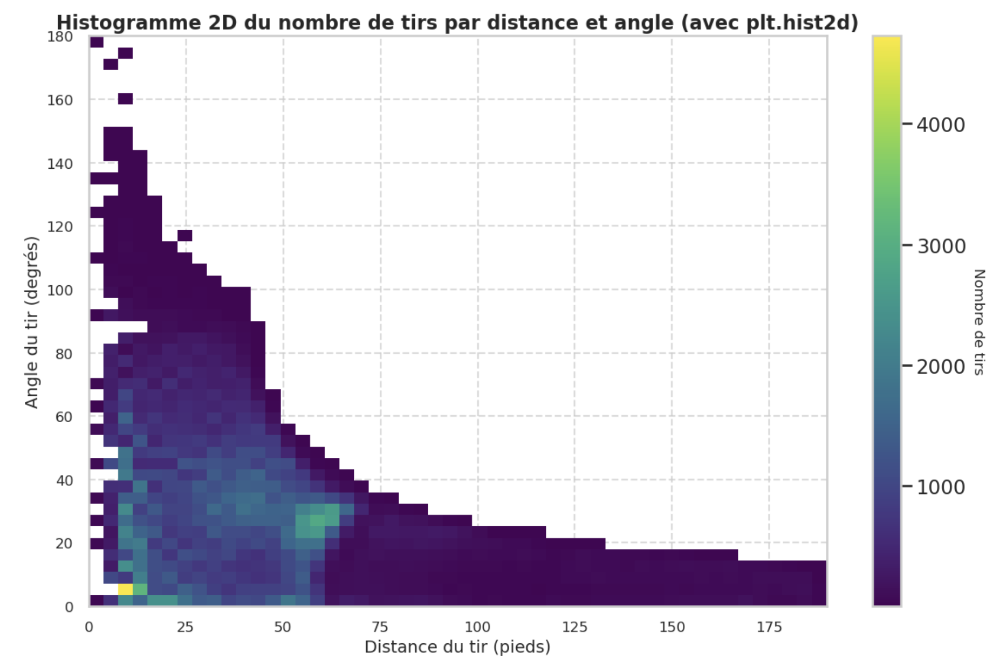

## Ingénérie des données

### Question 1
  

 L'analyse du nombre de tirs selon la distance au filet révèle une tendance claire : la majorité des tirs sont effectués à courte distance, en particulier dans la plage de 0 à 19 pieds. Cette tendance est cohérente pour les tirs ayant abouti à un but et ceux n'ayant pas marqué. Cependant, on observe que le nombre de buts diminue significativement à mesure que la distance augmente, tandis que les tirs non réussis dominent dans toutes les plages de distance. Cette observation peut être expliquée par le fait que, plus on s'éloigne du filet, plus la précision et la puissance nécessaires pour marquer augmentent, donnant un avantage au gardien pour effectuer un arrêt.

### Question 2
  

Concernant l'angle de tir, les tirs se concentrent majoritairement dans les plages de 0 à 39 degrés. Cela s'explique par la géométrie du hockey sur glace : les joueurs cherchent à maximiser leurs chances de marquer en se positionnant face au filet ou à un angle optimal. On observe également que les tirs avec des angles plus grands (au-delà de 120 degrés) sont rares. Ces tirs sont souvent réalisés dans des situations défensives ou désespérées, ce qui réduit leur probabilité de succès.

### Question 3
  

Le graphique 2D montre une forte densité de tirs dans la zone proche du filet (moins de 25 pieds) avec des angles inférieurs à 40 degrés. Cela indique que les joueurs optimisent généralement leurs positions pour obtenir des tirs avec une combinaison favorable de distance courte et d'angle réduit. La densité diminue progressivement à mesure que l'on s'éloigne du filet ou que l'angle augmente, soulignant que les tirs provenant de positions défavorables sont beaucoup moins fréquents.

### Question 4
  
Le taux de but diminue de manière significative avec l'augmentation de la distance. Dans les plages de 0 à 19 pieds, le taux de réussite est de 17,4 %, tandis qu'il chute à environ 2,5 % pour les distances entre 60 et 79 pieds. Cependant, une légère augmentation est visible pour les distances supérieures à 140 pieds, ce qui peut s'expliquer par des situations particulières telles que les filets vides. Cela montre l'importance de la proximité du filet pour maximiser les chances de marquer.

### Question 5

Le taux de but est également influencé par l'angle de tir. Les angles proches de 0 à 19 degrés ont un taux de réussite de 11,7 %, ce qui correspond à des tirs réalisés face au filet. Ce taux diminue avec l'augmentation de l'angle, atteignant son minimum autour de 60 à 79 degrés (5,2 %). Cependant, une forte augmentation est observée pour les angles extrêmes (160-179 degrés), bien que cela soit probablement dû à un faible nombre d'observations dans cette plage, rendant les résultats moins représentatifs.

### Question 6

L'histogramme illustre la répartition des buts en fonction de la distance au filet, en distinguant entre les filets vides et non vides. La majorité des buts dans des filets non vides se situent dans la plage de 0 à 19 pieds, ce qui reflète la difficulté pour un gardien d’arrêter un tir à courte distance. À mesure que la distance augmente, le nombre de buts diminue drastiquement, soulignant l'importance de la proximité pour la réussite d'un tir. En revanche, les buts marqués dans des filets vides, bien qu’ils soient également majoritairement concentrés dans la même plage de distance, montrent une présence notable même à des distances plus élevées. Cela peut être attribué aux décisions tactiques d'équipes retirant leur gardien dans des situations spécifiques, comme en fin de match.

Globalement, ces observations confirment que la probabilité de marquer dépend fortement de la distance au filet, mais aussi du contexte, notamment la présence ou non d'un gardien. Les filets vides introduisent des scénarios plus variés, où des tirs à plus longue distance deviennent réalisables, bien qu’ils restent rares.

### Question 7

| Colonne        | Description                      |
|-----------------------------|--------------------------------------------------|
| **Year**                   | Année                                           |
| **idGame**                 | Identifiant du match                            |
| **gameType**               | Type de match                                   |
| **periodType**             | Type de période                                 |
| **numberPeriod**           | Numéro de la période                            |
| **typeDescKey**            | Description de l'événement                      |
| **eventOwnerTeam**         | Équipe à l'origine de l'événement               |
| **gameSeconds**            | Temps écoulé dans le match (en secondes)        |
| **previousEventType**      | Type de l'événement précédent                   |
| **timeSinceLastEvent**     | Temps depuis le dernier événement               |
| **previousXCoord**         | Coordonnée X précédente                         |
| **previousYCoord**         | Coordonnée Y précédente                         |
| **xCoord**                 | Coordonnée X actuelle                           |
| **yCoord**                 | Coordonnée Y actuelle                           |
| **zoneShoot**              | Zone de tir                                     |
| **shootingPlayer**         | Joueur effectuant le tir                        |
| **goaliePlayer**           | Gardien de but                                  |
| **shotType**               | Type de tir                                     |
| **teamSide**               | Côté de l'équipe                                |
| **emptyGoalNet**           | Filet vide                                      |
| **isGoalAdvantage**        | Avantage lorsque but                   |
| **isGoal**                 | Est-ce un but ?                                 |
| **shotDistance**           | Distance du tir                                 |
| **distanceFromLastEvent**  | Distance depuis le dernier événement            |
| **rebound**                | Rebond                                          |
| **speedFromLastEvent**     | Vitesse depuis le dernier événement             |
| **shotAngle**              | Angle du tir                                    |
| **reboundAngleShot**       | Angle du tir après rebond                       |
| **offensivePressureTime**  | Temps de pression offensive                     |
| **powerPlayActive**        | Avantage numérique                     |

## Modèles simples

On remarque une précision d'eniron 90 % avec un modèle de régression logistique entrainé avec la caractéristique de distance. Si 90 % des tirs ne sont pas des buts, un modèle naïf pourrait obtenir une précision de 90 % simplement en prédisant toujours "non-buts". Cependant, ce modèle manquerait complètement de pertinence pour prédire des buts. On pourrait utiliser des métriques comme la précision pour chaque classe, le rappel (recall), le F1-score ou l'AUC-ROC pour évaluer la performance globale.  

Les graphiques révèlent que les performances d'une régression logistique basée sur les probabilités de marquer un but sont légèrement supérieures à celles d'un classifieur aléatoire. Cependant, cette amélioration reste marginale. Le classifieur entraîné avec les deux caractéristiques principales, la distance et l'angle de tir, affiche une AUC de 0,56, contre 0,50 pour le classifieur aléatoire. Ces résultats suggèrent que la distance et l'angle sont des variables pertinentes qui contribuent à différencier les situations de tir. Individuellement, la distance atteint également une AUC de 0,56, tandis que l'angle seul présente une AUC de 0,54.

En examinant la fiabilité, le diagramme de calibration montre que les prédictions du modèle sont mal calibrées : les probabilités prédites ne correspondent pas toujours à la fréquence observée des buts. Cela signifie que même si la distance et l'angle aident à discriminer les tirs, le modèle a tendance à surestimer ou sous-estimer les probabilités dans certains intervalles. Par ailleurs, les graphiques de taux de buts par centile et de proportion cumulée des buts indiquent que le modèle est légèrement meilleur que l'aléatoire pour identifier des situations avec une probabilité plus élevée de but.
 

  

  

  

Liens vers les modèles  
[Angle](https://wandb.ai/IFT67582024-A07/Logistic%20Regression%20Angle?nw=nwuserphilippebergeron7)  
[Distance + Angle](https://wandb.ai/IFT67582024-A07/Logistic%20Regression%20Distance%20Angle?nw=nwuserphilippebergeron7)  
[Distance](https://wandb.ai/IFT67582024-A07/Logistic%20Regression%20Distance?nw=nwuserphilippebergeron7)

## Modèles avancés

### Question 1
  

  

  

  

Les données d'entrée, composées de la distance et de l'angle des tirs, ont été divisées en un ensemble d'entraînement (80 %) et un ensemble de validation (20 %) de manière aléatoire. Le modèle utilisé est XGBoost, configuré avec des paramètres spécifiques : 100 arbres (n_estimators), un taux d'apprentissage (learning_rate) de 0,1, une profondeur maximale (max_depth) de 6, et un sous-échantillonnage (subsample) de 1.

XGBoost a montré des performances globalement meilleures que la régression logistique, avec une AUC de 0,62 contre 0,57 pour cette dernière, démontrant une meilleure capacité à différencier les buts des non-buts. Les graphiques générés, tels que la courbe ROC et la proportion cumulée des buts, confirment que XGBoost capture efficacement les situations à forte probabilité de but, surpassant ainsi la régression logistique et un modèle aléatoire.

Le graphique du taux de buts par centile a révélé que XGBoost identifie mieux les zones à haute probabilité de but, bien que le déséquilibre des classes dans les données reste visible. De plus, la proportion cumulée des buts montre que XGBoost est capable de capturer une proportion significative des buts dans les premiers centiles.

### Question 2

Toutes les caractéristqiues créées à la partie 4 sont utilisés.
La recherche par grille avec validation croisée a été utilisé pour chercher les meilleurs hyperparamètres. La grille est composée de valeur au dessus et en dessous des valeurs par défaut.

  

  
Ces hyperparamètres ont été utilisés pour contruire un nouveau modèle XGBoost.  

En comparant les résultats du modèle XGBoost avec toutes les caractéristiques disponibles à ceux obtenus avec le modèle de base dans la question 1, une amélioration significative de la performance est observée. Le modèle de base, utilisant uniquement les caractéristiques de distance et d'angle, a obtenu une AUC de 0,62. Avec l'ajout de toutes les caractéristiques pertinentes, l'AUC passe à 0,77.

Le graphique du taux de buts par centile montre que le modèle enrichi est plus efficace pour identifier les situations à forte probabilité de but, capturant une plus grande proportion de buts dans les centiles supérieurs de la probabilité prédite. En comparaison, le modèle de base, utilisant uniquement la distance et l'angle, présentait des performances proches d'un modèle aléatoire et avait une capacité réduite à prédire les tirs à fort potentiel de but. Le graphique de la proportion cumulée des buts révèle que le modèle XGBoost avec toutes les caractéristiques surperforme également le modèle de base, capturant davantage de buts dans les premiers centiles de probabilité. Enfin, le diagramme de fiabilité montre que le modèle enrichi est mieux calibré, avec une meilleure correspondance entre les probabilités prédites et les fréquences observées des buts, bien que la calibration reste imparfaite, en particulier dans les intervalles extrêmes.

Cette amélioration reflète la capacité de XGBoost à exploiter efficacement l'information supplémentaire pour capturer des relations plus complexes entre les données. Les résultats montrent que les nouvelles caractéristiques contribuent à enrichir la capacité prédictive du modèle, augmentant ainsi sa précision globale.

  

  

  

  

Lien vers modèle:  
[Tout caractéristiques](https://wandb.ai/orgs/philippe-bergeron-7-universit-de-montr-al-org/registry/model?selectionPath=philippe-bergeron-7-universit-de-montr-al-org%2Fwandb-registry-model%2FXGBoost&view=membership&tab=overview&version=v1)

### Question 3

  

Pour sélectionner les caractéristiques les plus pertinentes, l’outil SHAP (SHapley Additive exPlanations), qui permet d’évaluer l’impact de chaque caractéristique sur les prédictions du modèle XGBoost a été utilisé. SHAP attribue une valeur d’importance à chaque caractéristique, en quantifiant sa contribution positive ou négative à chaque prédiction, ce qui aide à identifier les caractéristques importantes influençant les résultats.

Initialement, toutes les caractéristiques disponibles ont été incluses dans le modèle XGBoost pour établir une performance de référence. Ensuite, SHAP a été appliqué pour analyser l’importance relative des caractéristiques. Les résultats ont montré que la distance du tir et l’angle du tir sont les plus influentes dans les prédictions, confirmant leur pertinence déjà observée dans des approches précédentes. D’autres variables, telles que le type de tir et le temps de jeu, ont également été identifiées comme pertinentes.

Sur la base des résultats de SHAP, un sous-ensemble de caractéristiques a été proposé, comprenant les variables les plus significatives identifiées par l’analyse. En comparant les performances avec ce sous-ensemble optimisé, le modèle a démontré une AUC légèrement inférieure par rapport à l’ensemble complet de caractéristiques (0,76 contre 0,77), mais une complexité réduite, ce qui pourrait être avantageux dans des scénarios où les ressources computationnelles ou l’interprétabilité sont critiques.

Les hyperparamètres suivant ont été choisis en fonction de la sélection des caractéristiques: 

 

En conclusion, l’utilisation de SHAP a permis de prioriser les caractéristiques et d’explorer des modèles simplifiés sans sacrifier de manière significative les performances. L’ensemble optimal de caractéristiques comprend la distance, l’angle, les types de tirs, le temps de jeu et le temps de pression offensif, qui, ensemble, capturent les relations essentielles entre les données et les résultats.

  

Les courbes du modèle simplifié:  

  

  

  

  

Lien vers modèle:  
[Simplifié](https://wandb.ai/orgs/philippe-bergeron-7-universit-de-montr-al-org/registry/model?selectionPath=philippe-bergeron-7-universit-de-montr-al-org%2Fwandb-registry-model%2FXGBoost&view=membership&version=v2)

### Question 6
Pour cette section, plusieurs approches ont été explorées afin d’identifier le modèle optimal pour prédire les buts attendus. Les modèles suivants ont été testés (avec tous les caractéristiques pertinentes):

1. **Réseaux de neurones (Neural Net)**
2. **Forêt aléatoire (Random Forest)**
3. **Machines à vecteurs de support (SVM)**
4. **Arbre de décision (Decision Tree)**

Chaque modèle a été évalué à l’aide de quatre métriques graphiques :
- **Courbe ROC/AUC** : Indique la capacité discriminative du modèle.
- **Taux de buts par rapport au centile de probabilité** : Évalue la précision des probabilités prévues.
- **Proportion cumulée de buts par rapport au centile de probabilité** : Mesure l’efficacité du modèle pour classer les probabilités.
- **Courbe de calibration** : Vérifie si les probabilités prévues sont bien calibrées.

## Résultats des modèles testés

### 1. Réseau de Neurones
[Lien vers l'expérience Wandb](https://wandb.ai/IFT67582024-A07/Neural%20Network/runs/jwixazbb?nw=nwuserthierrybedardcortey)
 

---

### 2. Arbre de Décision
[Lien vers l'expérience Wandb](https://wandb.ai/IFT67582024-A07/Decision%20Tree/runs/ui0umsu4?nw=nwuserthierrybedardcortey)

 

---

### 3. Forêt Aléatoire
[Lien vers l'expérience Wandb](https://wandb.ai/IFT67582024-A07/Random_Forest_Model/runs/dyrdg62u?nw=nwuserthierrybedardcortey)

---

### 4. SVM Linéaire
[Lien vers l'expérience Wandb](https://wandb.ai/IFT67582024-A07/SVM/runs/apn1u0xq?nw=nwuserthierrybedardcortey)

  

---

### Méthodes et Résultats Clés
| Modèle             | AUC (ROC) | Précision de Validation (val_accuracy) |
|---------------------|-----------|-----------------------------------------|
| Réseau de neurones (Neural Net) | **0.75316**  | 0.90611                                |
| Forêt aléatoire (Random Forest) | **0.75691**  | **0.90643**                            |
| Arbre de décision (Decision Tree) | 0.73933     | 0.90624                                |
| Machine à vecteurs de support (SVM) | 0.49962     | 0.90623

- **Réseaux de neurones** : Avec une AUC de 0.75316, ce modèle montre une excellente capacité discriminative. Cependant, sa précision de validation légèrement inférieure à celle de la forêt aléatoire suggère une calibration et une généralisation légèrement moins optimales.
- **Forêt aléatoire** : Avec une AUC de 0.75691 et la meilleure précision de validation à 0.90643, ce modèle s’avère être le **meilleur modèle final** en termes de performances globales et de robustesse.
- **SVM** : La faible AUC (0.49962) indique une incapacité à discriminer correctement les classes, bien que la précision de validation soit compétitive.
- **Arbre de décision** : Ce modèle a obtenu une AUC modérée (0.73933) et une précision de validation de 0.90624, le plaçant derrière la forêt aléatoire et le réseau de neurones.

### Meilleur Modèle Final
La **forêt aléatoire** a été identifiée comme le meilleur modèle grâce à :
- **AUC élevée** : La meilleure performance avec 0.75691.
- **Précision de validation la plus élevée** : Une généralisation robuste avec une précision de 0.90643 sur l'ensemble de validation.
- **Simplicité et robustesse** : Moins de dépendance à des ajustements complexes par rapport au réseau de neurones.
